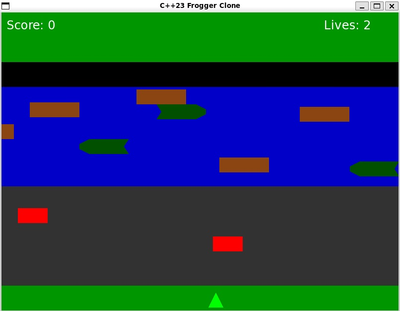

# CppFrogger

A Frogger clone implemented in C++23 using SFML.

## Description

This is a modern C++ implementation of the classic arcade game Frogger. The game features:

- A frog controlled by the player
- Moving vehicles that the player must avoid
- Water with floating logs that the player can jump on
- Dangerous crocodiles with snapping mouths
- Score tracking
- Lives system
- Start, pause, and game over screens

## Demo



## Requirements

- C++23 compatible compiler
- CMake 3.20 or higher
- SFML 2.5 or higher

## Building the Project

```bash
# Create a build directory
mkdir build && cd build

# Configure CMake
cmake ..

# Build
cmake --build .
```

## Running the Game

```bash
# From the build directory
./frogger
```

## Controls

- Arrow keys: Move the frog
- P or ESC: Pause/unpause the game
- R: Restart the game
- Q: Quit the game (from pause or game over screens)
- Space or Enter: Start the game (from the start screen)

## Game Flow

1. Start Screen: Shows game title and controls
2. Game Screen: Main gameplay with score and lives displayed
3. Pause Screen: Appears when 'P' or 'ESC' is pressed
4. Game Over Screen: Shows when you run out of lives

## Implementation Details

This implementation uses simple colored shapes instead of sprite images:

- Player (Frog): Green triangle pointing in direction of movement
- Vehicles: Red rectangles
- Logs: Brown rectangles
- Crocodiles: Green shapes with periodically changing colors (dark green means dangerous!)
- Road: Dark gray background
- Water: Blue background
- Safe areas: Green background

### Font Handling

The game tries to find a suitable TTF font in the following locations:

1. `fonts/any_font.ttf` - Add your own TTF font to the fonts directory
2. System fonts on Linux, Windows, and macOS

If you want to use custom fonts:
1. Add a TTF font file to the `fonts` directory
2. Name it `any_font.ttf` or modify the font loading code in `Game.cpp`

## License

This project is open source and available under the MIT License.
